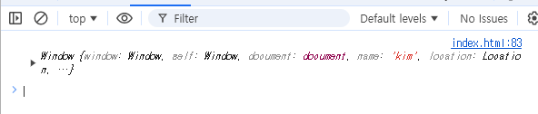
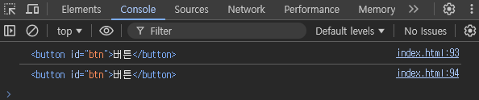

## JavaScript Review Day01

### 목차
> 1. `?.` / `.??` 연산자
> 2. JS 기초문법 
> 3. this 키워드
> 4. Arrow function
---
## `?.` / `.??` 연산자
> ECMAScript 2020 부터 새로생긴 문법 중 `optional chaining` 와 `nullish coalescing operator` 문법은 `null` 이나 `undefined` 를 예방해주는 문법이다.

### 1. optional chaining
- 보통 중첩된 object 에서 에러없이 데이터를 안전하게 접근하기 위해 쓴다.
  ```js
  var user = {
    name : 'kim',
    age : {value : 20}
  };
  ```
- 위와 같은 object 에서 없는 데이터를 건들게 되면 에러가 난다.
- 이를 방지하기 위해 ?. 연산자로 접근하면 된다.
  ```js
  var user = {
    name : 'kim',
    age : {value : 20}
  };

  console.log(user.age2?.value);
  ```
- 참고로 위 **문법은 에러를 해결하기위한 문법이 아닌 방지하는 문법**이다.

### 2. nullish coalescing operator
- `nullish coalescing operator` 문법은 `null` 이나 `undefined` 일 경우 특정 값을 출력하는 문법이다.
- 아래와 같이 통신프로그램인 경우 통신이 완료되기 전 까지 값이 없다. 그럴 경우 임의의 값을 출력하게 된다.
  ```js
  var user;

  console.log(user ?? '로딩중')
  ```
---
## JS 기초문법
### 1. JS 사용이유
- 주로 HTML 의 요소를 다루는데 자주 사용한다.
- id값이나 class 값을 통해 HTML 을 조작하는데 좋은 언어이다.
  ```js
  document.getElementById('hello').innerHTML = 'ㅋㅋ'; // HTML 요소 내용을 수정

  document.getElementById('btn').addEventListener('click', function () {
    alert('클릭함 ㅋㅋ');
  }); // HTML 요소 클릭 이벤트 
  ```
### 2. 기본문법 요약
- 변수를 선언하는 타입의 종류는 `var`, `const`, `let` 이 있다.
  - `var` : 예전에 자주사용하는 문법으로 **스코프의 범위가 넓어서** 현재는 비추천
  - `let` : 요즘에는 무조건 `let` 을 사용. **스코프의 범위는 선언된 코드블럭 내부**
  - `const` : **변하지 않는 값**에 사용
- 리스트(list)와 오브젝트(object)가 있다. 선언 방법은 다음과 같다.
  ```js
  // List(내부에 object가 올 수도 있고, list가 또 올수있다.)
  var names = ['kim', 'son', 'park'];
  console.log(names[1]);

  // Object(key:value 형식, value 에 object가 올 수 있다.)
  var family = { name: 'kim', age: 20 }; // key:value 
  console.log(family?.name);
  console.log(family['name']);
  ```
- if문과 for문은 다른 프로그래밍 언어와 거의 비슷하다.
  ```js
  if (name == 'kim') {
    console.log('kim');
  } else {
    console.log('no kim');
  }

  for (let i = 0; i < 5; i++) {
    console.log(i + '번 째 출력 ㅋㅋ');
  }
  ```
- 그리고 list 타입을 직접적으로 출력하는 forEach 문법도 있다.
  ```js
  [1, 2, 3, 4].forEach((data) => {
    console.log(data);
  })
  ```
  
---
## this 키워드
> this 키워드는 사용하는 환경에 따라 4개 이상의 각각 다른 뜻을 가지고 있다.<br>
> this는 호출시점에 실행함수가 가리키는 객체이다.  자신을 호출하는 방식에 의해 this 에 바인딩될 객체가 동적으로 결정된다.

### 1. `<script>` 내부에 사용
- 그냥 `console.log(this);` 를 호출하게 되면 다음과 같이 나온다.
  ```js
  console.log(this)
  ```
  
- 여기서 `window` 란 모든 **전역변수**, **함수**, **DOM**을 보관하고 관리하는 전역객체이다.
### 2. 함수 내부에서 호출
- 함수 내부에서 호출 시 다음과 같다.
  ```js
  fn();
  function fn() {
    console.log(this);
  }
  ```
  
### 3. strict mode
- IE 10 버전 이상에서는 `'use strict'` 키워드를 **최상단에 추가**하면 strict mode 로 js 작성이 가능하다.
- strict 모드에서는 키워드 없이 변수를 선언하거나, 이상한 키워드로 선언하는 것을 방지해준다.
- strict 모드에서 **this 키워드를 일반 함수 안에서 호출하면 undefined 값을 반환**한다.
  ```js
  'use strict'
  fn();
  function fn() {
    console.log(this);
  }
  ```
  
### 4. object 내부 함수에서 호출
- object 의 value 값으로 함수를 넣어주고 함수 내부(메소드라 칭함)에서 `this` 를 호출하게 되면 `this`는 **메소드를 가지고 있는 오브젝트**를 뜻하게 된다..
  ```js
  let 오브젝트 = {
    data: 'kim',
    func: function () {
      console.log(this);
    }
  };
  오브젝트.func();
  ```
  
- 단, 애로우 함수에서는 window 가 호출된다.
  ```js
  let 오브젝트 = {
    data: 'kim',
    func: () => {
      console.log(this);
    }
  };
  오브젝트.func();
  ```
  
### 5. constructor 안에서 쓰는 this
- JS 에서 비슷한 Object 를 여러개 생성할 때 constructor 를 사용하면 된다.
- 그리고 이 때 this 를 사용하여 새로운 Object 를 생성한다.
  ```js
  let temp = {};

  function func() {
    this.이름 = 'kim';
  }

  let obj = new func();
  console.log(obj);
  ```
  

### 6. 이벤트 리스터(Event Listener)에서 쓰는 this
- 이벤트 리스너 내부에서 `this` 를 사용한다면 `e.currentTarget` 과 같은 의미이다.
  ```js
  document.getElementById('btn').addEventListener('click', function (e) {

    console.log(this);
    console.log(e.currentTarget);
  });
  ```
  
- 이벤트 리스너 내부에서 콜백함수를 선언하고 콜백함수 내에서 this 를 호출하면 그냥 window 가 출력된다. 콜백함수는 전역함수이기 때문이다.
- 오브젝트 안에서 쓰는 콜백함수 또한 window 가 출력된다.
- 단, 콜백함수를 애로우함수로 사용하게 되면 this 값을 그대로 호출하게 된다.
  ```js
  document.getElementById('btn').addEventListener('click', function (e) {
      let obj2 = {
        names: ['kim', 'lee', 'park'],
        funcs: () => {
          //console.log(this)
          obj2.names.forEach(() => {
            console.log(this);
          });
        }
      }
      obj2.funcs();
  });
  ```
  
---
## Arrow function
> Arrow 문법은 함수를 좀 더 간편하게 사용하기 위한 문법이다.

### 일반 함수와 Arrow function 차이
- 일반 함수를 호출할 때는 아래와 같이 호출한다.
  ```js
  let func = function(){
    // ....
  }
  ```
- 하지만 Arrow 문법은 function 키워드를 사용하지 않고, `=>` 화살표를 사용한다.
  ```js
  let func = ()=>{
    // ...
  }
  ```
### Arrow function 장점
- Arrow function 은 기존 함수를 좀 더 간략하게 사용할 수 있다.
```js
let func = function(a){
  console.log(a+5);
}
```
- 위 함수를 Arrow 문법을 적용하면 다음과 같다.
```js
let func = (a)=>{
  console.log(a+5);
}
```
- 간단해지긴 했지만 저기서 더 생략이 가능하다.
  - 파라미터가 1개인 경우 소괄호 생략
  - 명령문이 1줄인 경우 return, 중괄호 생략
  ```js
  let func = a => console.log(a+5);
  ```
### Arrow function 응용
- 주로 리스트를 for문 돌려 데이터를 꺼낼떄 유용하다.
  ```js
  [1,2,3,4].forEach(a=>console.log(a));
  ```