## JavaScript Review Day02

### 목차
> 1. 변수 신문법
> 2. 문자열 문법
> 3. Spread Operator

---
## 변수 신문법
> 기존에는 변수를 선언할 때 `var` 만 썻지만 ES6 부터 `let` , `const`가 추가되었다.

### 1. var , let , const
- 전부 변수를 선언하는 키워드이지만 재선언, 재할당, 범위가 각각 다르다.

  |**키워드**|**재선언**|**재할당**|**범위**|
  |---|---|---|---|
  |`var`|O|O|function 내부|
  |`let`|X|O|코드블럭({ }) 내부|
  |`const`|X|X|코드블럭({ }) 내부|
- `const` 의 경우 `Object` 로 선언하면 내부는 수정이 가능하다.
  ```js
  const 사람 = {
    이름: 'kmi'
  }

  사람.이름 = 'kii';

  console.log(사람.이름);
  ```
  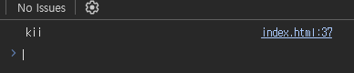
- 하지만 `const` 로 선언된 모든것을 수정불가능하게 하고싶으면 다음과 같이 작성하면 된다.(단, strict 모드에서는 에러다.)
  ```js
  const 사람 = {
    이름: 'kim'
  }

  Object.freeze(사람);
  사람.이름 = 'son';

  console.log(사람.이름); // 에러는 안나지만 바뀌지는 않는다.(strict 모드는 에러)
  ```
  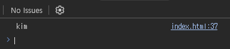
### 2. Hoisting, 전역변수, 참조
- `Hoisting` 이란 변수나 함수 선언 시 선언부분을 변수나 함수의 범위 맨 위로 끌고가서 해석하는 것을 의미한다.
- 예를 들어 다음과 같은 코드가 있다고 하자.
  ```js
  var age = 30;
  ```
- 위 코드는 우리눈에 안보이지만 JS 가 해석할 때 다음과 같이 바뀐다.
  ```js
  var age;

  age = 30;
  ```
- JS 는 맨 위에서부터 해석되므로 먼저 age 선언부분이 해석되고 그 다음에 값이 할당된다.
- 만약 `Hoisting` 이 없다면 첫 번째 줄에서 에러가 나야하지만 `undefined` 가 출력이 되는 것을 알 수 있다.
  ```js
  console.log(age);
  var age = 30;
  console.log(age);
  ```
  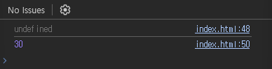
  - *단, `let` , `const` 는 호이스팅이 안되고 에러가 나온다!*
- 전역변수는 말 그대로 어디서든 쓸 수 있는 큰 범위에 있는 변수인데 선언 방식은 2가지이다.
- 함수 바깥에서 선언하여 전역변수 사용
  ```js
  var name = 'son';
  function func(){
    console.log(age);
  }
  func();
  ```
  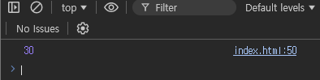
- `window` 키워드를 사용하여 전역변수 사용
  ```js
  window.name = 'CR7';

  function func2() {
    console.log(name);
  }

  func2();
  ```
  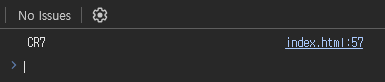
---
## 문자열 문법
### 1. template Literals
- ES6 부터 나온 문법이다. 이 문법은 기존의 문자열을 다르게 작성하는 방법이다.
- `(백틱) 을 이용한다.
- 이 문법은 문자열안에 엔터키를 넣어서 줄바꿈이 되어도 인식이 되고, 중간에 변수를 넣는것도 가능하다.
- 변수를 넣을 때는 `${변수}` 를 사용한다.
  ```js
  let age = 30;
  let name = 'Son'
  let info = `My name is ${name}, my age ${age}`;
  ```
  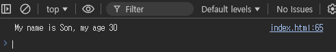
### 2. Tagged Literals
- ES6 부터 나온 문법으로 쉽게 말해 문자 해체분석기능이다.
- 예를 들어 `template Literals` 문법으로 작성한 문자열에서 안에 들어간 변수만 뺴고싶을 때 사용한다.
- 만약, 해체하고 싶은 문자열에 변수가 한개라면 함수에서 파라미터를 2개만 받고 변수가 더 있다면 그만큼 늘어난다.
- 그리고 해체를 하고 남은 문자열들은 리스트로 저장이 된다.
  ```js
  function 해체분석기(문자들, 변수들1, 변수들2) {
    console.log(문자들[0]);
    console.log(문자들[1]);
    console.log(변수들1);
    console.log(변수들2);
  }

  해체분석기`My name is ${name}, my age ${age}`;
  ```
  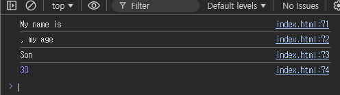
---
## Spread Operator
> ES6 부터 나온 문법으로, 쉽게 말해 괄호를 벗겨내거나 붙혀주는 문법이다.

### 1. List 조작
- List에서 내용을 추출할 때 사용
  ```js
  let array = ['hello', 'wolrd'];
  console.log(...array);
  ```
  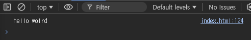
- 일반 문자열도 한글자씩 분리해준다.
  ```js
  let word = 'hello';
  console.log(...word)
  ```
  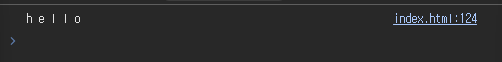
- List를 합칠 수 있다.
  ```js
  let array1 = [1, 2, 3];
  let array2 = [4, 5];

  let array3 = [...array1, ...array2];
  console.log(array3);
  ```
  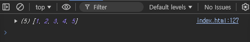
### 2. Object 조작
- `Object` 도 `List`와 같다. 하지만 키 값이 중복될 경우 나중에 오는 키값이 적용된다.
  ```js
  let obj1 = { a: 1, b: 2 };
  let obj2 = { ...obj1, c: 3 };
  console.log(obj2);
  ```
  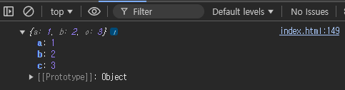

### 3. 깊은 복사, 얕은 복사
- 기존 List에 `Spread` 연산자를 이용해 대입하여 새로운 List를 만들면 얕은복사가 된다.
- 하지만 `=` 연산자를 이용하면 깊은 복사가 된다.
  ```js
  let a = [1, 2, 3];
  let b = a;
  console.log(a === b);

  // 얕은복사
  let c = [1, 2, 3];
  let d = [...c];

  console.log(c === d);
  ```
  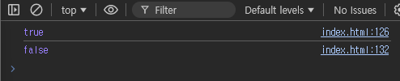
### 4. 함수 파라미터 조작
- `List`로 이루어진 연속된 숫자를 더해주는 함수가 있을 때 `Spread` 문법을 이용하면 쉽게 전달할 수 있다.
  ```js
  function plus(a, b, c) {
    console.log(a + b + c);
  }

  let numArr = [10, 20, 30];
  plus(1, 2, 3);
  plus(...numArr);
  ```
  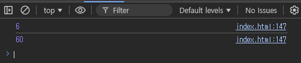
---
