## JavaScript Review Day03

### 목차
> 1. ES6 Function
> 2. Reference Data Type
> 3. constructor(상속)
> 4. prototype
> 5. ES5 문법으로 상속 구현

---
## ES6 Function
> ES6 부터는 함수의 기능이 추가되었다.

### 1. Default 파라미터
- 함수를 선언할 때 3개의 파라미터를 받는 함수를 만들고, 호출할 때 파라미터를 1개만 적어도 오류는 나지 않는다.
  ```js
  function add(a, b) {
    console.log(a + b);
  }
      
  add(1); 
  ```
  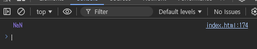
- 개발자의 실수를 에러없이 안전하게 해주는 것도 있지만 로직상에는 문제이다.
- 이 때 `Default` 값을 미리 정할 수 있다.
  ```js
  function defaultAdd(a, b = 10) {
    console.log(a + b);
  }

  defaultAdd(1);
  ```
  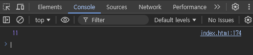
### 2. 함수의 arguments
- 함수를 선언할 때 파라미터를 각각 출력하고 싶다면 아래와 같이 작성한다.
  ```js
  function add(a, b, c) {
    console.log(a);
    console.log(b);
    console.log(c);
  }

  add(1, 2, 3);
  ```
  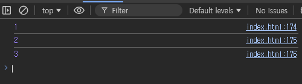
- 하지만 파라미터가 수백개라면 파라미터가 늘어난 만큼 로직도 추가하고 추후 유지보수의 문제가 있다.
- 이런 경우 `arguments` 를 이용하면 다수의 파라미터를 쉽게 다룰 수 있다.
  ```js
  function add(a, b, c, d, e, f, g) {
    for (let i = 0; i < arguments.length; i++) {
      console.log(arguments[i]);
    }
  }

  add(1, 2, 3, 5, 6, 4, 7);
  ```
  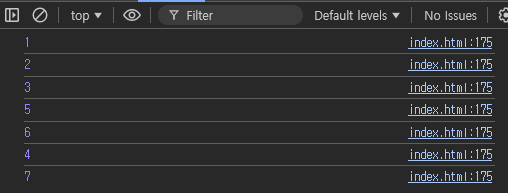
### 3. Rest 파라미터
- `arguments` 는 옛문법이다.
- `arguments` 의 단점은 파라미터가 100개라면 100개의 파라미터를 선언해줘야 하는 단점이 있다.
- 그리고 파라미터중 특정 파라미터만 출력할려면 `arguments` 를 사용할 수 없다.
- 이런 단점을 보완한 문법이 `Rest 파라미터`이다.
- 아래 코드는 1,2번째 파라미터가 아닌 뒤에오는 파라미터들만 출력하는 함수이다.
  ```js
  function add(a, b, ...parameters) {
    parameters.forEach(d => console.log(d));
  }
  add(1, 2, 3, 4); 
  ```
  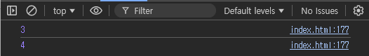
- 그리고 파라미터 100개를 다 출력한다면 아래와 같이 작성하면 된다.
  ```js
  function add(...parameters){
    parameters.forEach(d => console.log(d));
  }
  ```
---
## Reference Data Type
> JS 에서는 자료형은 `Primitive data Type` 과 `Reference data Type` 으로 나뉜다.

### 1. Primitive data Type
- 기본형은 데이터 자체가 변수에 저장되는 자료형이다.
- 문자, 숫자 자료형들이 대표적인 `Primitive data Type` 이다.
  ```js
  let name = 'son';
  let age = 39;
  ```
### 2. Reference data Type
- `Array` , `Object` 자료형은 `Reference data Type`에 속한다.
- `Reference data Type` 은 데이터 자체가 변수에 저장되는게 아닌 **참조값이 변수에 저장**된다.
- 만약 `Reference data Type` 변수를 복사한다면 참조값이 복사되기 때문에 **원본값을 수정하면 복사값도 바뀐다.**
  ```js
  let name1 = { name: 'kim' }; // Reference Data Type : Object , Array 
  console.log(name1);

  let name2 = name1;
  name2.name = 'son';
  console.log(name2);
  ```
  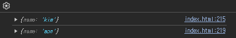
- 하지만 Object 타입을 복사할 때는 조심해야 한다. 
- 아래 코드처럼 Object 를 변경하는 함수를 만들면 원하는대로 변경이 안된다.
  ```js
  let names = { name: 'kim' };

  function objectChange(obj) {
    obj = { name: 'son' };
  }

  objectChange(names);
  console.log(names);
  ```
  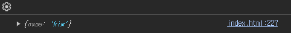
---
## constructor(상속)
> constructor 문법을 사용하면 Object 를 많이 생성하고 안전하게 만들 수 있다.

### 1. constructor
- 예를 들어 학생 Object 를 여러개 만든다면 안에 들어가는 데이터로 `name` 과 `age` 가 있다.
- 기존의 `{}` 를 통해 만든다면 학생수 만큼 코드가 늘어난다.
- 이 때, `construtor` 문법을 사용하면 쉽게 만들 수 있다.
  ```js
  function Student(name, age) {
    this.name = name;
    this.age = age;
  }

  let s1 = new Student('kim', 15);
  let s2 = new Student('son', 16);
  let s3 = new Student('park', 17);
  ```
  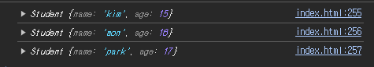
- 만약 `construtor` 에 자기소개를 하는 메서드를 넣고싶다면 아래와 같이 수정하면 된다.
  ```js
  function Student(name, age) {
    this.name = name;
    this.age = age;
    this.sayHi = function () {
      console.log('안녕하세요 ' + this.name + ' 입니다.');
    }
  }

  let s1 = new Student('kim', 15);
  let s2 = new Student('son', 16);
  let s3 = new Student('park', 17);

  s1.sayHi();
  s2.sayHi();
  s3.sayHi();
  ```
  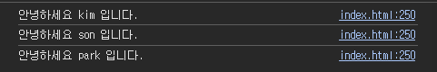
---
## prototype
> 위에서 했던ㄷ `constructor` 문법은 객체지향 용어로 **상속(ingeritance)** 이라 한다.
> `prototype` 도 상속 문법 중 하나이다.

### 1. prototype 사용방법
- 보통 constructor 를 생성하면 prototype 이라는 필드가 자동생성된다.
- 쉽게 말해, 부모의 유전자 역할 같은 것이다.
- 만약 `Student` 에 `prototype` 에 `gender` 라는 속성을 추가하면 이후에 생성되는 `Student` 는 자동으로 `gender`라는 값을 물려받는다.
  ```js
  function Student(name, age) {
    this.name = name;
    this.age = age;
    this.sayHi = function () {
      console.log('안녕하세요 ' + this.name + ' 입니다.');
    }
  }

  Student.prototype.gender = 'male';

  let s1 = new Student('Park', 15);
  let s2 = new Student('Son', 12);

  console.log(s1.gender);
  ```
  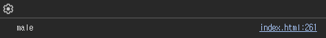
### 2. 내장함수
- `toString()` , `sort()` , `forEach()` 등등 내장함수를 사용할 수 있던것도 `prototype` 덕분이다.
- `[1,2,3]` 이라는 `Array` 를 생성하면 자체적으로 `new Array(1,2,3)` 이 실행하는데 이 때 **Array 로 부터 sort() 같은 내장함수를 물려받기 때문에 사용가능한 것이였다.**
```js
let arr = [1,2,3];
// let arr = new Array(1,2,3);

console.log(arr.toString());
```
### 3. prototype 특징
1. prototype 은 함수에만 동작한다.
2. 부모의 정보를 알고 싶으면 `__proto__` 이용
---
## ES5, ES6 문법으로 상속 구현
> 기존 상속을 구현하였던 `prototype` 이나 `function func(){~~~}` 로 상속을 구현한 방법은 옛 문법이다.
> ES5 로 상속을 구현하는 법은 다르다.
### 1. ES5 문법으로 상속
- `Object` 변수를 하나 생성하고 물려주고 싶은 자식 변수에 `Object.create()` 에 파라미터로 부모변수를 넣으면 상속이 구현된다.
  ```js
  let parent = {
    name: 'Kim', age: 50, sayHi: function () {
      console.log(`안녕하세요 ${this.name} 입니다. 저는 ${this.age}살 입니다.`);
    }
  };

  let child = Object.create(parent);

  console.log(child);
  console.log(child.name); // 상속받음
  console.log(child.age); // 상속받음
  child.sayHi(); // 상속받음
  ```
  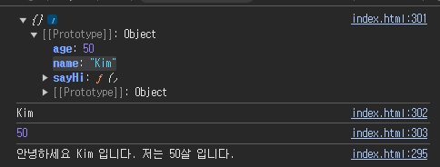
### 2. ES6 문법으로 상속 구현
- ES6 문법에서 상속은 다른 객체지향 프로그래밍 언어에서 자주보던 문법이다.
  ```js
  class Parent {
    constructor(name, age) {
      this.name = name;
      this.age = age;
      // 자식만 갖고있는 함수는 여기다 작성
    }
    sayHi() { // 부모가 함수를 가진다.
      console.log(`안녕하세요 저는 ${this.name}이고, 나이는 ${this.age}살 입니다.`);
    }
  };
  ```
- 자식만 갖고 있는 함수를 구현할려면 `constructor()` 안에 `this` 를 통해 생성하고, 부모가 가지고 있는 공통함수를 구현할려면 `constructor()` 밖에다 선언하면 된다.
### 3. extends / super
- class 끼리 상속관계를 만들 때는 자식클래스에서 `extends` 키워드를 통해 class 를 생성하면 된다.
- 주의할 점은 부모 `constructor()` 에서 파라미터를 받는다면 자식 객체에서 `super()`를 통해 파라미터를 담아서 넘겨줘야 한다.
  ```js
  class 할아버지 {
    constructor(name) {
      this.성 = 'Kim';
      this.이름 = name;
    }
  }

  let 할아버지1 = new 할아버지('일성');

  console.log(할아버지1);

  class 아버지 extends 할아버지 {
    constructor(name) {
      super(name);
      this.나이 = 50;
    }
  }
  ```
  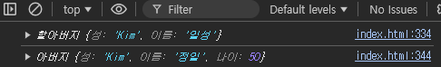
### 4. getter / setter
- `JS` 에서 `getter`/`setter` 는 오브젝트 내의 함수를 괄호없이 쓸 수 있게 해주는 키워드이다.
- 깊게 설명하면 **데이터의 무결성을 보존하기 위해 쓰는 키워드**이다.
- 데이터를 건들때는 함수를 통해 간접적으로 건들어야 한다.
- 아래 예제는 나이를 반환할 때 1살 더해서 반환하는 getter가 있다. 이때 원본데이터 age 는 값이 변하지 않는다.
  ```js
  class 사람 {
    constructor() {
      this.name = 'Park';
      this.age = 20;
    }
    get nextAge() {
      return this.age + 1;
    }
    set setAge(age) {
      this.age = age;
    }
  }
  ```
  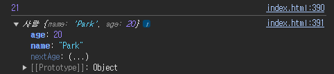
- 또한 값을 수정할 때는 직접적으로 수정하는게 아닌 함수를 통해서 수정한다.

  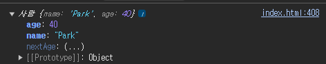
---