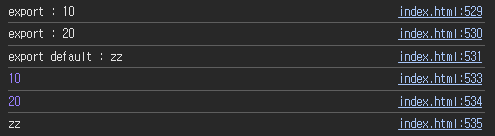

## JavaScript Review Day04

### 목차
> 1. Destructuring 문법
> 2. import / export
> 3. 브라우저 동작원리
> 4. 동기/비동기 콜백함수
> 5. async / await
> 6. Map, Set 자료형
> 7. shadow DOM
---
## Destructuring 문법
> ES6 이후부터 Array, Object 에 있는 특정 Key값이나 데이터를 꺼내서 변수화를 하고 싶으면 `Destructuring`문법을 사용한다.

### Array
- `Array` 에 있는 데이터를 각각 변수로 넣고싶다면 아래와 같이 작성한다.
  ```js
  let arr = [2, 3, 4];

  let a = arr[0];
  let b = arr[1];
  let c = arr[2];
  ```
- `Array` 를 `Destructuring` 문법을 적용한다면 다음과같다.
  ```js
  let arr = [2, 3, 4];

  let [a, b, c] = arr;

  console.log(a);
  console.log(b);
  console.log(c);
  ```
  
- 디폴트값도 지정할 수 있다.
  ```js
  let [d, e, f = 10] = [2, 3]; // 선언만 하고 할당을 안하면 undefined
  console.log(d);
  console.log(e);
  console.log(f);
  ```
  
### Object
- `Object` 도 마찬가지이다. Key값을 이용해 변수에 저장하였지만 `Destructuring` 문법을 적용하면 더 간단하게 저장할 수 있다.
  ```js
  let obj = { name: 'Kim', age: 30 };
  // let name = obj.name;
  // let age = obj.age;

  let { name, age } = obj; // 변수명과 key명을 맞춰줘야함.
  console.log(name);
  console.log(age);
  ```
  
- 반대로 미리 선언한 변수를 `Object` 형식으로 담는것도 가능하다. 단, 변수명이 Key 명으로 들어가게 된다.
  ```js
  let name = 'Kim';
  let age = 30;

  // let obj = { name: name, age: age };
  let obj = { name, age }; // 변수명이 Key명으로 매칭이 된다.
  console.log(obj);
  ```
  
---
## import / export
> ES6 부터 import 와 export 의 방식이 바뀌었다.

### 1. import
- HTML 파일 안에서 ES6 import 문법을 사용할려면 `<script>` 태그를 아래와 같이 설정해줘야 한다.
  ```html
  <script type="module">
    // ~~~~~내용
  </script>
  ```
- `import` 는 별도의 파일을 불러오는 키워드이고 `export` 는 별도의 파일에서 내보낼 변수등을 설정하는 키워드이다.
- `import` 문법은 총 3가지이다.
  ```HTML
  <script type="module">
    import * as lib from '/library.js' // 파일전체를 가져온다.
    import importA from '/library.js' // export default 값을 별칭을 통해서 받아온다.
    import { a, b } from '/library.js' // export 값들을 {}로 묶어서 변수명을 갖고온다.
    console.log(a);
    console.log(b);
    console.log(importA);

    console.log("export : " + a);
    console.log("export : " + b);
    console.log("export default : " + importA);

    console.log(lib.a);
    console.log(lib.b);
    console.log(lib.default); // default 는 default를 통해 가져온다.
  </script>
  ```
  
### 2. export
- `export` 키워드와 `{}`를 이용해 내보낼 변수들을 지정할 수 있다.
- `export default` 는 기본으로 내보낼 변수이고, `import` 하는 파일에서 별칭을 통해 사용할 수 있다.
- 단, `export default` 는 파일당 1개만 사용가능하다.
  ```js
  let a = 10;
  let b = 20;
  let c = 'zz';
  // export default a; // export deault 는 파일당 1회만 사용
  export default c;
  export { a, b }; 
  ```
---
## 브라우저 동작원리
> 웹 브라우저란 서버에서 받아온 `HTML`, `CSS`, `JS`를 실행시켜주는 프로그램이다.<br>
> 브라우저는 C++ 코드로 짜여져 있는데 JS코드를 보면 `Stack` 공간에 넣어서 실행한다. 그래서 맨 윗줄부터 하나하나 실행하게 된다.

### 1. Stack / Queue
- `Stack` 은 **선입후출(PILO)**구조이고, `Queue` 는 **선입선출(PIPO)** 구조이다.
- `setTimeout()` 이나 `Ajax` 요청, `이벤트리스너` 등등 즉각적으로 실행하지 않는 비동기 코드들은 Stack 공간에 들어가지 않는다.
- 위 코드들은 `Queue` 라는 공간에 들어가는데 `Stack` 이 텅 빈 시점에 `Queue`에서 `Stack` 으로 옮겨준다.
---
## 동기/비동기 콜백함수
> JavaScript 는 동기 프로그래밍 언어이다. 하지만 비동기로 코드를 짤 수 있다.
### 1. Web API
- JS 에서 setTimeout(), Ajax, EventListener 등 비동기를 구현하는 코드들은 Web API 덕분에 비동기 처리가 가능하다.
- 즉, Web API 에서 잠시 코드를 갖고 있다가 특정 시간 이후 코드를 실행하게 한다.

### 2. 콜백함수
- 만약 `setTimeout()` 을 이용하여 동기적으로 처리하고 싶다면, 쉽게 말해 `Python` 언어의 `sleep()` 함수와 같이 구현하고 싶다면 콜백함수를 사용한다.
- **콜백함수**란 **함수안에 함수가 있다는 의미**이다.
  ```js
  function 첫째함수(){
    console.log(1)
  }

  function 둘째함수(){
    console.log(2)
  }

  첫째함수();
  둘째함수();
  ```
- 위 코드를 콜백함수 패턴으로 구현하면 아래와 같다.
  ```js
  function 첫째함수(콜백){
    console.log(1);
    콜백();
  }

  function 둘째함수(){
    console.log(2)
  }

  첫째함수(둘째함수);
  ```
- 하지만 콜백함수가 많으면 많아질수록 코드가 점점 길어지고 더러워진다. 이런 문제를 해결하기 위해 `Promise` 라는 문법을 사용한다.
### 3. Promise
- `Promise` 란 기능이라기 보다 **코드/함수 디자인 패턴**중 하나이다.
  - 물론 위에 콜백함수 패턴도 디자인 패턴중 하나이다.
- `Promise` 패턴은 **성공/실패를 판정해주는 디자인패턴**이다.
- 성공을 하면 `then` 절이 실행되고, 실패할 경우 `catch` 절이 실행된다.
  ```js
  let 프로미스 = new Promise();

  프로미스.then(function(){

  }).catch(function(){

  });
  ```
- **콜백함수 패턴보다 Promise 패턴을 쓰는 이유는 실패 로직을 구현**할 수 있기 때문이다.
- 기본적으로 `reject()` 함수를 실행하면 무조건 실패, `resolve()` 함수를 실행하면 무조건 성공이다.
- 그리고 성공시 `then()` 절이 실행되고, 실패 시 `catch()`절이 실행된다.
  ```js
  let promise = new Promise(function (resolve, reject) {
    let hard = 1 + 1;
    // resolve(hard);
    reject("비상");
  });

  promise.then(function (result) {
    console.log("성공 ㅋㅋ 답 : " + result);
  }).catch(function (error) {
    console.log("실패 ㅋㅋ 에러 : " + error);
  })
  ```
### 4. Promise 상태
- Promise 는 크게 3가지의 상태를 가진다.
  - 성공 후 : `resovled`
  - 실패 후 : `rejected`
  - 판정 대기중 : `pending`
---
## async / await
> `async` / `await` 문법은 ES8 이후에 나온문법이다. 이 문법은 Promise를 간편하게 쓰는 문법이지만 실패판정 시 에러가 난다.

### 1. async 
- `async` 키워드는 함수 앞에 써준다.
- `async` 가 붙은 함수는 `Promise` 객체가 자동으로 생성이 된다.
  ```js
  async function add() {
    let promise = new Promise(function (resolve, reject) {
      let hard = 1 + 1;
      resolve(hard);
    });

    promise.then(function () {
      console.log("성공했어요");
    })
  }
  add();
  ```
  
- 단, 실패 판정 시 에러가 발생하므로 `try-catch` 로 묶어준다.
### 2. await
- `then` 절을 대신 해주는 문법이다. `async` 가 붙은 함수 내부에서만 사용가능하다.
  ```js
  async function add() {
    let promise = new Promise(function (resolve, reject) {
      let hard = 1 + 1;
      resolve(hard);
      // reject(100);
    });

    // promise.then(function () {
    //   console.log("성공했어요");
    // })
    try {
      let result = await promise; // awit : async 함수 내부에서만 사용가능, promise 가 해결될 때 까지 기다린다.
      console.log(result);
    } catch {
      console.log('실패');
    }
  }
  add();
  ```
  
---
## Map, Set 자료형

### 1. Map 자료형
- `Map` 자료형은 ES6 이후에 나온 문법으로 `key => value` 형식의 자료형이다.
- `Map` 자료형을 쓰는 이유는 **자료의 연관성을 표현**하기 위해 쓴다. 
  ```js
  let person = new Map();
  person.set('name', 'Kim'); // set(key,value) 로 저장, key는 어떤 자료형이든 다 가능하다.
  person.set('age', 20);
  console.log(person);

  let age = person.get('age'); // get(key) : key에 맞는 value를 출력
  console.log(age);

  console.log(person.size); // key 갯수 출력

  // 반복문
  for (let key of person.keys()) {
    console.log(key);
  }

  for (let value of person.values()) {
    console.log(value);
  }
  let person2 = new Map([
    ['name', 'Kim'],
    ['age', 20]
  ]);

  console.log(person2);
  ```
  
### 2. Set 자료형
- `Set` 은 중복을 허용하지 않는 `Array` 라고 생각하면 된다.
  ```js
  var 출석부 = new Set(['john', 'tom', 'andy', 'tom']);
  console.log(출석부);

  출석부.add('ronaldo');
  console.log(출석부);

  출석부.delete('tom');
  console.log(출석부);
  ```
  
---
## shadow DOM
> `shadow DOM` 은 쉽게 말해 일밙거으로 볼 수 없는 숨겨진 HTML 이다.

### 1. shadow DOM 보기
- 예를 들어 `range` 타입의 `input` 태그를 보면 여러개의 `div`가 섞인것처럼 보이는 경우가 있다.
- 개발자 도구를 켜고 내부를 들여다보면 `#shadow-root` 안에 `div`가 숨겨져있는 것을 알 수 있다.
  ```html
  <input type='range'>
  ```
  
  

### 2. shadow DOM 만들기
- `shadow DOM` 을 개발자가 생성하며 HTML 컴포넌트를 구현할 수 있다.
- 이 때 `attachShadow()` 라는 함수를 사용한다. 이 함수를 사용하면 `shadowRoot` 라는 공간이 생긴다.
- `shadowRoot` 공간에 원하는 HTML 넣으면 숨겨진다.
  ```js
  document.querySelector("#mordor").attachShadow({ mode: 'open' });
  document.querySelector("#mordor").shadowRoot.innerHTML =
    `<p>안녕하세용</p>`
  ```
  

### 3. Web Components
- Web Component 를 사용하면 html 함수처럼 재사용이 가능하다.
- 사용방법은 다음과 같다.
  ```html
  <custom-input></custom-input>
  <script>
      class 클래스 extends HTMLElement {
        connectedCallback() {
          this.innerHTML =
            `<label>이메일</label><input>
          <style>label {color:red}</style>`;
        }
      }
      customElements.define("custom-input", 클래스);
  </script>
  ```
  
- 위 코드의 문제점은 `<custom-input>` 태그 위에 `<label>` 태그를 생성하면 그 태그도 `style` 이 적용된다.
  ```html
  <label>hihihihi</label>
  <custom-input></custom-input>
  <script>
      class 클래스 extends HTMLElement {
        connectedCallback() {
          this.innerHTML =
            `<label>이메일</label><input>
          <style>label {color:red}</style>`;
        }
      }
      customElements.define("custom-input", 클래스);
  </script>
  ```
  
- 이런 경우 `Shadow DOM` 을 사용한다.
- 이렇게 되면 HTML 덩어리를 모듈화하여 독립적으로 가능하다.
  ```html
  <label>hihihihi</label>
  <custom-input></custom-input>
    <script>
    class 클래스 extends HTMLElement {
      connectedCallback() {
        this.attachShadow({ mode: 'open' });
        this.shadowRoot.innerHTML =
          `<label>이메일</label><input>
        <style>label {color:red}</style>`;
      }
    }
    customElements.define("custom-input", 클래스);
  </script>
  ```
  
### 4. template
- `<template></template>` 태그는 HTML 를 임시보관하는 저장소이다.
- 위에서 작성했던 `innerHTML` 코드를 실제 `HTML` 코드로 만들어서 `template` 태그안에 두었다.
  ```html
  <template id="template1">
    <label>이메일을 입력해라</label><input>
    <style>
      label {
        color: red
      }
    </style>
  </template>
  ``` 
- 그리고 js 코드에서 다음과 같이 사용한다.
  ```js
  class 클래스 extends HTMLElement {
    connectedCallback() {
      this.attachShadow({ mode: 'open' });
      this.shadowRoot.append(template1.content.cloneNode(true));
    }
  }
  customElements.define("custom-input", 클래스);
  ```
  